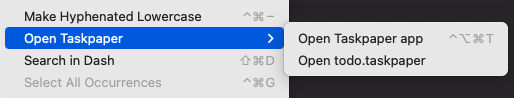

**Open Taskpaper** adds the ability to open the current project's `todo.taskpaper` in Nova, or an external app of your choice.

## Usage

To access the commands:

- Select the **Editor → Open Taskpaper** menu item; or
- Open the command palette and type `open task` to see all provided commands.

The available workspace commands are:

- **Open Taskpaper app**
- **Open todo.taskpaper**

### Configuration

You can select which `app` to open the `todo.taskpaper` file in. The default value is `/Applications/Nova.app`, so the file will open in a new tab in the current workspace.

Alternatively, you can choose an external app such as [Taskpaper.app](https://www.taskpaper.com).

To configure global preferences, open **Extensions → Extension Library...** then select Open Taskpaper's **Preferences** tab.

You can also configure preferences on a per-project basis in **Project → Project Settings...**

## Keyboard

Shortcut/hot keys for any of the provided menu items can be set the normal Nova way using **Preferences... → Key Bindings** and searching for *Taskpaper* will filter menu items to include those provided by this extension.

## Notes

If `todo.taskpaper` does not exist then you'll get an error. You will need to create that file yourself.
